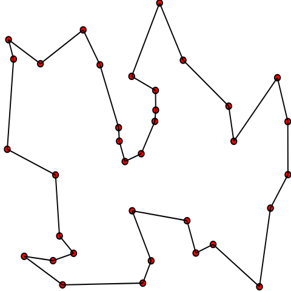

# Fun TSP Challenge

### Purpose

This challenge is intended to be fun, relaxed, and collaborative. Today you should just sit back, relax, share ideas, and simply enjoy the art of computer programming.

### What is TSP?

The Traveling Salesperson Problem (TSP) is set up like this:

> You are a salesperson, and you have a list of cities you want to visit. You wish to travel to each city exactly once then return home. What order should you visit the cities to minimize the total distance you travel?

This is obviously a Graph Theory problem. We can model this problem as a graph where cities are nodes, and between every pair of cities there's a edge weighted by the distance between those cities.

The path the salesperson will take is a cycle, so when posed as an optimization problem we don't actually care in which city the salesperson starts the cycle--the final solution is the same. Here is an example of a graph with the TSP solution drawn as a cycle through every node:



### The Challenge

TSP is a tough problem. In fact, _tough_ doesn't adequately describe it. It's **so tough** that _literally_ no one yet knows if there's a "fast" algorithm which gives an optimal solution. (We define "fast" to mean that the algorithm runs in polynomial time.)

Of course there _is_ a "slow" algorithm that gives an optimal solution. (Here we define "slow" to mean something beyond polynomial time, such as exponential time.) One slow algorithm goes like this:

```
best_path = None
shortest_dist = infinity

for each permutation p of the cities:
    interpret p as a path through the cities
    dist = the total distance traveled in path p

    if dist < shortest_dist:
        shortest_dist = dist
        best_path = p

return best_path
```

Normally computers handle tons of data easily. We're accustomed to giving our computers millions or billions of datapoints and having them return results in a few seconds. But, that's not going to be the case with the algorithm above. For example, if you give that algorithm 15 cities, you'll have to wait a very long time to get an answer (several, several hours). And if you give that algorithm, say, a measly 20 cities, the algorithm will not finish running within your lifetime. We'll call the algorithm above the "brute-force" algorithm for TSP.

### Your Turn

All is not lost with TSP. We can invent new algorithms which approximate the solution to TSP, giving "good enough" solutions. These algorithms are driven by heuristics which we can invent, and they will run quickly by design.

Now it's your turn! Let's write some approximate TSP solvers.

### Toy Datasets

We'll assume the salesperson lives in a boring, flat, 2d Cartesian plane, and that each city can be described simply as existing at a single (x, y) location. Each datafile describes some number of cities, one city per line in the file, where each city has a name and a location.

I've provided four toy datasets for you to play with.

#### Tiny Dataset

[data/tiny.csv](data/tiny.csv)

This dataset contains only 10 cities, so you can use the exact, optimal, brute-force algorithm for this one. (But first you'll have to write that algorithm!)

#### Small Dataset

[data/small.csv](data/small.csv)

This dataset contains 30 cities, clustered into 3 regions. (You'll have to find the regions yourself, either by visualizing the data or via a clustering algorithm like k-means.)

Hint: Can you find local optimal solutions within each region then combine those local solutions intelligently?

#### Medium Dataset

[data/medium.csv](data/medium.csv)

This dataset contains 100 cities, clustered into 10 regions.

#### Large Dataset

[data/large.csv](data/large.csv)

This dataset contains 1,000 cities, clustered into 50 regions.

### Starter Code

I've provided you with some starter code that will help you read the data and score your TSP solutions. Have look at [tsp_starter.py](tsp_starter.py).

### Enjoy the Craft

It's time for you to get to programming. This is your chance to chill out and enjoy the craft. [Build your castles.](https://gist.github.com/acu192/44582a272508c69541867f371490df25)

### More Reading

- [Wikipedia: Traveling Salesman Problem](https://en.wikipedia.org/wiki/Travelling_salesman_problem)
- [Wikipedia: NP-completeness](https://en.wikipedia.org/wiki/NP-completeness)
- [Wikipedia: Greedy Algorithm](https://en.wikipedia.org/wiki/Greedy_algorithm)
- [Wikipedia: k-means clustering](https://en.wikipedia.org/wiki/K-means_clustering)
